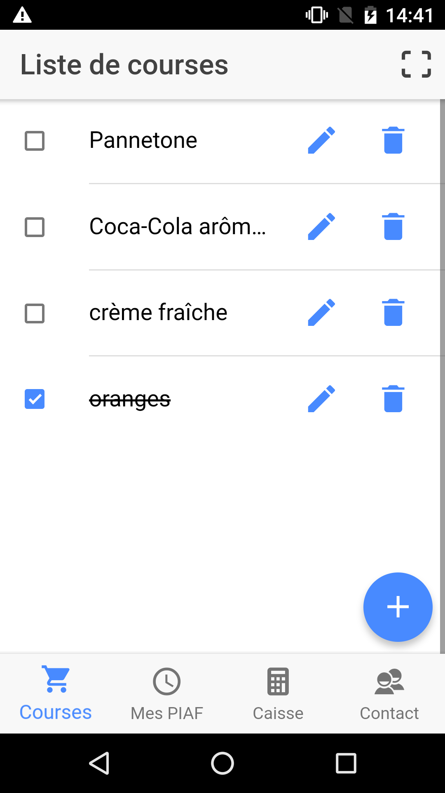
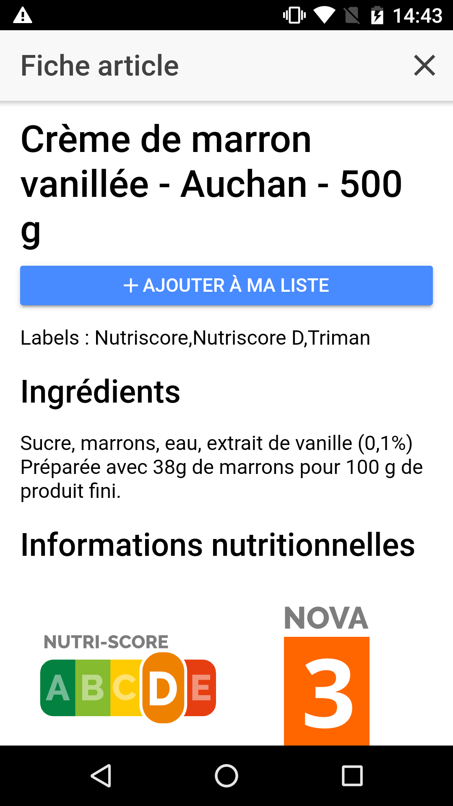
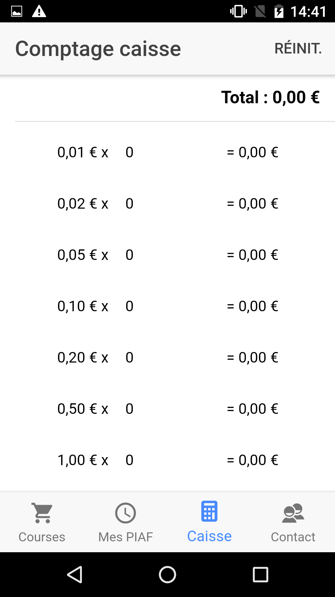
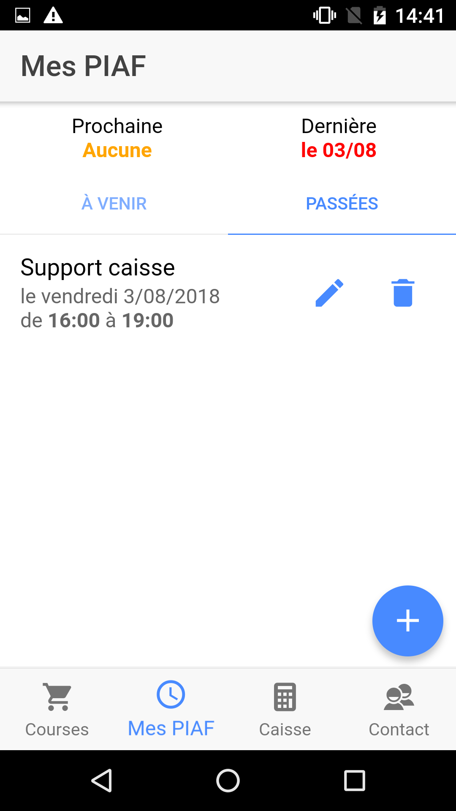

# La Chouette Appli 

Maquette d'application mobile pour LCC, le projet de supermarché coopératif et participatif toulousain
www.lachouettecoop.fr

**ATTENTION** : si vous n'êtes pas membre de la coopérative, cette application n'est que d'une utilité limitée. 

## Fonctionnalités

- calcul de caisse espèces
- liste de courses
- pense-bête créneaux de participation, avec vue synthétique (dernière/prochaine PIAF)
- scan d'articles pour obtenir des informations supplémentaires (via OpenFoodFacts - nécessite une connexion Internet) ou ajouter l'article à la liste de courses
- accès à des infos supplémentaires sur les produits via QR code

A venir selon faisabilité technique et besoins exprimés : 

- liens vers le journal _le bec et la plume_
- ~~relevés de prix~~
- ~~carte de membre dématérialisée~~ (rendu caduc par les nouvelles cartes avec photo, mais présent dans le code)

## Galerie

   

## Prérequis pour le développement

- Node.js >= 6
- Pour le développement Android : JDK 1.8.* (Java 9 et supérieur n'est pas supporté), Android Studio avec le SDK Android, un téléphone sous Android paramétré pour le développement (sources inconnues/apps non signées/mode développeur)
- Pour le développement sous iOS : un Mac avec XCode, un iPhone

## Prérequis utilisateur

- Android récent (>= 5.x) avec sources inconnues activées

## Compilation

`npm install -g ionic cordova@8.0.0`  
`cd laChouetteAppli && npm install` pour les paquets javascript  
`ionic cordova add android`  
Vérifier qu'un dossier plugins a été créé et que le fichier `android.json` contient bien la liste dans la partie `installed_plugins`.  

Prévisualisation dans le navigateur : `ionic serve` (les fonctionnalités natives génèrent des erreurs)  
Compilation en natif : `ionic cordova build android`, avec éventuellement les options `--prod` et `--release`  
Attention: en mode release, bien effectuer les étapes complémentaires de signature de l'apk et de zipalign, sinon l'installation échouera systématiquement. 

## Licence

GPL v3. Voir le fichier LICENSE pour plus de détails. 
